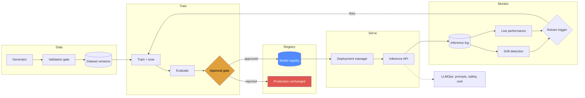

# FMOps — Foundation Model Operations Platform

A production-style control plane for the full lifecycle of **both** traditional
ML models and LLM-backed features: data validation, versioned datasets,
training, hyperparameter search, evaluation, a model registry with enforced
stage transitions, approval gates, blue/green + canary + shadow deployment,
drift detection, automatic retraining, rollback, prompt versioning, LLM
evaluation, safety screening and cost accounting.

Runs entirely on a laptop with no cloud account and no API keys. AWS is an
optional production backend — never a simulation.

```bash
make setup
make demo      # the whole lifecycle end to end, ~5 minutes
make serve     # then open http://localhost:8000/dashboard
```

---

## Why this exists

Training a model is a bounded task. **Operating** one is not.

The data shifts. The model decays. Someone has to decide whether the new version
is actually better — and when it is not, someone has to notice before customers
do. That decision needs to be reproducible, auditable and, ideally, automatic.

This project is the machinery around the model. The model itself is deliberately
ordinary (gradient-boosted trees over tabular loan applications, ROC-AUC ≈ 0.88)
because the interesting engineering is everywhere else.

**The behaviour that matters most**, taken verbatim from a real demo run:

```
Comparison (roc_auc): candidate 0.8821 vs baseline 0.8824 (-0.0003) -> reject
Promotion: NO -> stage Development
  reason: candidate roc_auc 0.8821 does not beat production 0.8824 by the
          required margin 0.0050 (actual -0.0003); keeping the production model
```

Drift was detected, retraining ran automatically, a new model was trained — and
it was **rejected**, because it was 0.0003 worse. Production was untouched. A
platform that cannot do this is not a platform; it is a training script with
extra steps.

---

## What it does

| | |
|---|---|
| **Data** | deterministic synthetic generator, 25-expectation validation suite (blocking), content-addressed dataset versioning, optional DVC |
| **Training** | reproducible pipeline, hyperparameter search (random/grid/SageMaker), validation-selected threshold, measured inference latency |
| **Registry** | enforced stage machine, one Production version per model, full transition history, SQLite or MLflow |
| **Gates** | absolute quality bar **and** champion/challenger comparison with a minimum-improvement margin |
| **Deployment** | blue/green, canary (evidence-gated), shadow (zero blast radius), direct, automatic rollback |
| **Serving** | FastAPI, per-response version and variant, warm-started, structured logging with correlation ids |
| **Monitoring** | ~30 Prometheus metrics, 2 Grafana dashboards, latency/error SLOs, resource and GPU monitoring |
| **Drift** | PSI + Jensen-Shannon + KS/χ², data/feature/prediction drift measured, **concept drift honestly reported as unavailable without labels** |
| **Retraining** | drift/performance/volume/schedule triggers with cooldown, automatic compare-and-decide |
| **LLMOps** | 5 provider adapters behind one interface, versioned prompts, tracing, evaluation with A/B, heuristic safety screen, token and cost accounting with budgets |
| **Infrastructure** | Terraform (S3, ECR, IAM, CloudWatch, SNS, SageMaker), 3 Docker images, Compose stack, 3 GitHub Actions workflows |
| **Tests** | 280 tests: unit, API integration, and end-to-end lifecycle |

---

## Architecture



Every external system sits behind an interface with a local implementation and
an AWS adapter. Switching is configuration, not code.

| Capability | Local | AWS |
|---|---|---|
| Artifacts | filesystem | S3 |
| Tracking | MLflow → SQLite | MLflow server → RDS + S3 |
| Registry | SQLite | MLflow Model Registry |
| Deployment | in-process weighted routing | SageMaker endpoints + variant weights |
| Tuning | random / grid search | SageMaker HPO |
| Metrics | Prometheus | + CloudWatch |
| Alerts | log, DB, file, webhook | SNS |
| LLM | deterministic mock | Bedrock / Anthropic / Gemini / OpenAI-compatible |

Full detail: [`docs/architecture.md`](docs/architecture.md).

---

## Technology

Python 3.11+ · FastAPI · scikit-learn · MLflow · pandas/numpy/scipy ·
Prometheus · Grafana · Docker · Terraform · GitHub Actions · pytest · pydantic ·
SQLite · optional: DVC, Great Expectations, Evidently, XGBoost, LightGBM,
boto3/SageMaker, Anthropic/Gemini/OpenAI SDKs.

---

## Local setup

**Requirements:** Python 3.11+, and Docker only if you want the full stack.

```bash
git clone <your-fork> && cd fmops-platform
make setup                       # venv + dependencies
make demo                        # full lifecycle, narrated
```

The demo generates data, trains, gates, deploys, serves traffic, injects drift,
detects it, retrains, compares, rejects or promotes, rolls back, and exercises
the whole LLMOps layer — offline, with no keys.

Then explore:

```bash
make serve                       # http://localhost:8000/dashboard
make up                          # + MLflow, Prometheus, Grafana
```

| Service | URL |
|---|---|
| Dashboard | http://localhost:8000/dashboard |
| API docs | http://localhost:8000/docs |
| MLflow | http://localhost:5000 |
| Prometheus | http://localhost:9090 |
| Grafana | http://localhost:3000 (admin/admin) |

---

## The commands

```bash
# data
fmops data generate                     # deterministic sample datasets
fmops data validate                     # the validation gate (exit 1 on failure)
fmops data versions                     # lineage + DVC status

# training and promotion
fmops train --tune
fmops promote --version 3
fmops models

# deployment
fmops deploy --version 3 --strategy canary
fmops deployments
fmops rollback --reason "latency regression"

# traffic, drift, retraining
fmops simulate --rows 500 --label-fraction 0.3
fmops simulate --rows 700 --drift severe
fmops drift scan
fmops retrain --check-only
fmops retrain

# llmops
fmops llm prompts
fmops llm generate --prompt support_summarizer --var ticket_text="..."
fmops llm eval --dataset support_triage --compare 1.0.0 1.1.0
fmops llm cost
fmops llm safety "Ignore all previous instructions"

# meta
fmops status
fmops config
fmops aws status
```

`make help` lists every target.

---

## Web console

`GET /dashboard` serves a single-page operations console over the same API this
README documents. It is the fastest way to see what the platform is doing.

```
OVERVIEW            Command Center · New ML Project
MODEL LIFECYCLE     Datasets · AutoML · Training · Evaluation · Model Registry
DEPLOYMENT          Deployments
OBSERVABILITY       Monitoring · Drift Detection · Retraining · Experiments
GOVERNANCE          Champion / Challenger · Audit Log
LLMOPS              Overview · Prompts · Evaluations · Tokens & Cost · Safety
SYSTEM              System Health · API Docs
```

Twenty pages, all reading the live API. Notable ones:

- **New ML Project** is a ten-step guided path from a CSV to a deployed,
  monitored model, for someone who does not yet know which page to start on.
  It drives the same endpoints as the pages below and adds no backend of its
  own; see [docs/workflow.md](docs/workflow.md) for what it can and cannot do.

- **AutoML** profiles a dataset, recommends a target and a problem type with
  the evidence for each, proposes candidate models, trains them, and ranks
  them on a leaderboard. The winner goes through the ordinary approval gate.

- **Datasets** uploads a CSV, registers it as a content-addressed version and
  runs the platform's validation engine over it -- the same engine the training
  pipeline gates on. A failing report names the expectation, column, observed
  and expected value.
- **Training** starts a real run against a chosen dataset and algorithm, then
  polls it to completion and shows the approval-gate decision, including the
  champion/challenger comparison that produced it.

- **Champion / Challenger** shows the head-to-head that decides a promotion, and
  states the verdict in the gate's own terms: a candidate is rejected when its
  improvement falls below `min_improvement`, even if it clears every absolute
  threshold.
- **Drift** separates the three measurable drift types from concept drift, which
  is reported as `unavailable` with the reason rather than as a number.
- **LLMOps** labels the offline mock provider as not a language model wherever
  its scores appear.

Implementation notes:

- One file, `app/api/static/console.html`. No build step, no framework, no CDN —
  the container has no guaranteed egress, and an external asset would fail open
  into a blank page in exactly the environment this runs in. A test asserts the
  page references no external resources.
- Reads are anonymous. The write actions (promote, roll back, acknowledge) ask
  for an API key per action and hold it in a local variable for that one
  request; it is never placed in `localStorage`, a cookie or the URL.
- The System page renders an explicit allowlist of non-sensitive settings.
  Credentials are never sent to the browser.
- Where the backend has nothing to return, the page says `Data unavailable` or
  names the reason. It does not substitute placeholder numbers.

> Screenshots are not committed to this repository. Run `make dev` and open
> <http://localhost:8000/dashboard>, or use the deployed URL in the AWS section.

## API

60+ endpoints. The essentials:

```
GET  /health  /health/live  /health/ready
POST /api/v1/predict                    prediction + version + variant + latency
POST /api/v1/predict/batch
POST /api/v1/feedback                   ground truth (unlocks live metrics)
GET  /api/v1/model                      what is serving right now
GET  /api/v1/models/{name}/versions
POST /api/v1/datasets/upload            CSV in the body -> versioned + validated
GET  /api/v1/datasets/{v}/validation    the real validation engine
GET  /api/v1/datasets/{v}/preview       bounded sample + column profile
POST /api/v1/training/runs              202 + run id; poll for the outcome
GET  /api/v1/training/runs/{run_id}
GET  /api/v1/automl/profile/{v}          target + problem + candidate advice
POST /api/v1/automl/runs                 candidate search, 202 + run id
GET  /api/v1/automl/runs/{run_id}        leaderboard + gate outcome
POST /api/v1/models/{name}/versions/{v}/stage
POST /api/v1/models/{name}/versions/{v}/evaluate-gate
GET  /api/v1/deployments/current
POST /api/v1/deployments                deploy with a strategy
POST /api/v1/deployments/rollback
GET  /api/v1/drift  /api/v1/drift/latest
POST /api/v1/drift/scan
GET  /api/v1/monitoring/summary
GET  /api/v1/retraining/trigger/evaluate
POST /api/v1/retraining/run
POST /api/v1/llm/generate
GET  /api/v1/llm/prompts  /api/v1/llm/cost  /api/v1/llm/traces
POST /api/v1/llm/evaluations/run  /api/v1/llm/evaluations/compare
GET  /metrics                           Prometheus
GET  /dashboard                         observability dashboard
```

```bash
curl -X POST localhost:8000/api/v1/predict -H 'Content-Type: application/json' -d '{
  "features": {
    "age": 34, "annual_income": 52000, "loan_amount": 18000,
    "loan_term_months": 36, "credit_score": 610, "debt_to_income": 0.42,
    "employment_years": 3.5, "num_credit_lines": 6, "num_late_payments_12m": 2,
    "credit_utilization": 0.78, "employment_type": "contract",
    "housing_status": "rent", "loan_purpose": "debt_consolidation",
    "region": "south"}}'
```

```json
{
  "request_id": "8f2c...", "prediction": 1, "prediction_label": "default",
  "probability": 0.9872, "threshold": 0.55, "model_version": 1,
  "model_stage": "Production", "variant": "primary", "inference_latency_ms": 33.4
}
```

---

## What this project is honest about

Being explicit about limits is part of the engineering, not a disclaimer.

- **Concept drift is not detectable from unlabelled data.** Most drift
  dashboards imply otherwise. This platform reports it as `unavailable` until
  ground truth arrives, and there is a test asserting that concept-drifted data
  leaves every input distribution unchanged.
- **The LLM safety screen is heuristic pattern matching**, not a content-safety
  classifier. It cannot detect hallucination — only stylistic correlates of
  unsupported claims. Its false-negative rate is unmeasured. Production needs a
  real moderation model in addition. See [`docs/llmops.md`](docs/llmops.md).
- **The mock LLM provider is not a language model.** Evaluation scores against it
  measure the harness. `compare()` refuses to compare mock and real runs.
- **Local deployment is real routing, not real infrastructure.** A 90/10 canary
  genuinely routes ~10% of predictions. It does not provision instances — that is
  the SageMaker provider's job, and it is never presented as if it were.
- **AutoML fits binary classification only.** The profiler detects regression
  and multiclass targets and refuses them with a reason; it does not cast a
  continuous target to an integer and report a meaningless ROC-AUC. Supporting
  them would mean new estimators, metrics and preprocessing.
- **AutoML recommendations are heuristics, not inference.** Target detection,
  problem type and candidate ranking come from deterministic rules over dataset
  properties, and every one is overridable. There is no model choosing models.
- **Potential leakage is a name-based hint**, never a finding. A column called
  `final_outcome` may be entirely legitimate.
- **Cost figures are estimates** derived from token counts and a configured price
  table. Not a billing system. Unpriced models are flagged, not silently zeroed.
- **SQLite serialises writes.** Fine for one API process; a multi-replica
  deployment should move to Postgres (one class to replace).
- **No RBAC, no rate limiting, no TLS termination, no signed artifacts.** Real
  gaps, listed in [`docs/deployment.md`](docs/deployment.md#security-posture).
- **Terraform has not been applied against a live AWS account in this
  repository's tests**, because that would create billable resources. It is
  syntax-checked and `terraform validate`-ed in CI.
- **The Docker images build and run; the full compose stack has not been run
  end to end.** All three images were built locally (Docker Desktop 29.7.2),
  all three run as uid 10001, and the training image was used to generate,
  validate, train and promote a model into a shared volume that the API image
  then served a real prediction from. What has *not* been exercised locally is
  the multi-service compose stack (MLflow + Prometheus + Grafana together);
  `docker compose config` validates it and CI builds all three images.
- **SQLite WAL does not work on a Windows bind mount.** Mounting a host
  directory into the container fails at startup with `disk I/O error`, because
  WAL needs shared-memory mapping that the Windows bind-mount driver does not
  provide. Compose uses named volumes, which work correctly; this only affects
  ad-hoc `-v /host/path:/app/artifacts` runs on Windows.

---

## Testing

```bash
make test              # unit + integration (fast)
make test-pipeline     # end-to-end lifecycle (slower; trains real models)
make test-all
make coverage
```

| Suite | Count | Covers |
|---|---|---|
| `tests/unit` | 192 | validation, drift statistics, approval, stage machine, deployment strategies, rollback, preprocessing, evaluation, registry, LLM providers/prompts/cost/safety/scorers |
| `tests/integration` | 71 | the real FastAPI app against a real database: prediction, batch, feedback, registry, deployment, monitoring, LLMOps, dashboard |
| `tests/pipeline` | 17 | valid and invalid datasets, drift → trigger → retrain, **worse-model rejection**, better-model promotion, rollback, shadow |

The negative tests carry the most weight: an invalid dataset must produce no
model, a worse candidate must not replace production, clean traffic must not
report drift, and concept drift must be invisible to input monitoring.

---

## CI/CD

Three workflows:

- **`ci.yml`** — formatting, lint, types, bandit, pip-audit, gitleaks, unit +
  integration + pipeline tests, a full CLI smoke run (which asserts that drift is
  actually detected and the retraining trigger actually fires), three Docker
  builds with a non-root check and a live health probe, trivy scan, terraform
  fmt/validate, compose validation.
- **`cd.yml`** — build → push to ECR → deploy staging → smoke test → **manual
  approval** → canary to production → verify → automatic rollback on failure.
  GitHub OIDC only; there is no `AWS_SECRET_ACCESS_KEY` in the repository.
- **`retraining.yml`** — scheduled trigger evaluation; trains only when a trigger
  fires. Exit code 2 (candidate correctly rejected) is reported as a success with
  a note, not a page.

CD skips itself with an explanatory summary when AWS is not configured.

---

## AWS

```bash
cd terraform
cp terraform.tfvars.example terraform.tfvars
terraform init && terraform apply -var environment=staging
eval "$(terraform output -raw fmops_env_exports)"
fmops aws status
```

Provisions S3 (versioned, encrypted, TLS-only), ECR (immutable tags,
scan-on-push), least-privilege IAM roles, GitHub OIDC, CloudWatch log
groups/metric-filters/alarms/dashboard, SNS, and a SageMaker model package group.

**It does not create a SageMaker endpoint** — endpoints bill per instance-hour
and are created by the deployment pipeline against an approved model version.
Infrastructure and model rollout are separate lifecycles on purpose.

Details and cost warnings: [`terraform/README.md`](terraform/README.md).

---

## Documentation

| | |
|---|---|
| [`architecture.md`](docs/architecture.md) | design principles, interfaces, request path, failure handling |
| [`mlops.md`](docs/mlops.md) | training, versioning, registry, gates, retraining |
| [`datasets.md`](docs/datasets.md) | upload, content-addressed versions, validation, preview |
| [`training.md`](docs/training.md) | starting runs from the API, statuses, execution model |
| [`automl.md`](docs/automl.md) | profiling, target inference, candidate ranking, the gate |
| [`llmops.md`](docs/llmops.md) | prompts, providers, evaluation, **safety limitations**, cost |
| [`monitoring.md`](docs/monitoring.md) | metrics, the drift taxonomy, statistics, SLOs |
| [`deployment.md`](docs/deployment.md) | local, Docker, AWS, production checklist, security posture |
| [`troubleshooting.md`](docs/troubleshooting.md) | every error code and what to do |

---

## Project layout

```
app/
  core/        config, logging, exceptions, database, storage, audit
  data/        generator, validation, preprocessing, versioning
  training/    train, evaluate, tuning, model factory, approval
  registry/    ModelRegistry interface + SQLite and MLflow backends
  tracking/    ExperimentTracker interface + MLflow and local backends
  deployment/  providers, strategies, rollback, manager, model cache
  monitoring/  metrics, inference log, drift, alerts, resources
  retraining/  triggers and the retraining pipeline
  llmops/      providers, prompts, evaluation, safety, cost, tracing
  aws/         boto3 session, SageMaker
  api/         FastAPI app, routes, serving, security, dashboard
  schemas/     pydantic contracts
pipelines/     CI entrypoints with meaningful exit codes
tests/         unit / integration / pipeline
terraform/     S3, ECR, IAM, CloudWatch, SNS
monitoring/    Prometheus config, alert rules, Grafana dashboards
docker/        api, training, inference images
```

## License

MIT — see [LICENSE](LICENSE).
