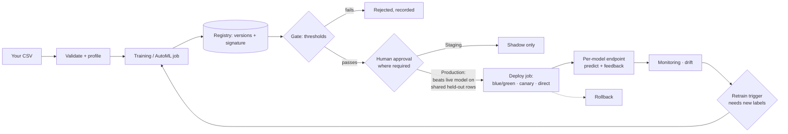

# FMOps — an ML lifecycle platform you can run on your own data

Upload a CSV, pick the column to predict, and FMOps takes it through the whole
operational lifecycle — **validate → profile → train (as a job) → track →
evaluate → register → gate → approve → deploy → predict → monitor → detect
drift → retrain on new labels → compare → promote or reject → roll back** —
with every step persisted, auditable and visible in a web console.

It runs on a laptop with no cloud account and no keys. The same code runs on
AWS (ECS Fargate behind an ALB); see [AWS](#aws).

```bash
make setup
make serve          # http://localhost:8000/dashboard  →  "New ML Project"
```

---

## What it is — and what it is not

FMOps operates **binary classifiers on tabular CSV data**. It is not a general
"any model, any framework" platform, and does not claim to be:

- Models are **scikit-learn pipelines trained inside the platform** (logistic
  regression, random forest, histogram gradient boosting; XGBoost and LightGBM
  when installed). There is **no upload of arbitrary model files** — the
  platform never deserialises a pickle it did not produce.
- The target must have **exactly two classes** (`yes`/`no`, `0`/`1`,
  `churned`/`stayed`, …). Regression and multiclass targets are detected and
  refused with the reason, never trained anyway.
- Datasets are **CSV**, versioned by content.

Inside that scope, the lifecycle is real: nothing in the console is a mock-up,
and every number on it is read from an API that computed it.

---

## The lifecycle, on your own dataset



1. **Upload** a CSV. It is stored immutably under a content hash (identical
   bytes return the existing version) and validated against its *own* columns.
2. **Profile** it. Every column gets a role and a reason; the target is
   recommended from observable evidence, and you confirm it.
3. **Name the model and train.** AutoML trains several candidates, or you pick
   one algorithm. Training runs as a **job** with a streamed log. The model
   name keeps one target for life.
4. **Registry.** The winner becomes a version with its **signature** — the
   input contract (features, kinds, ranges, categories, class labels) recorded
   at training time.
5. **Gate.** Absolute thresholds (F1, ROC-AUC, latency, clean validation) and,
   for Production, a **champion/challenger comparison on the same held-out
   rows neither model trained on**. Every decision is persisted with every
   check.
6. **Approve.** Where the environment requires a human (`pending_manual`),
   Approve/Reject re-run the gate and record the actor and comment. Approval
   cannot push a failing version through, and there is no `force` in the API.
7. **Deploy** onto the model's **own endpoint** (blue/green, canary, direct,
   shadow) as a job. Only a **Production** version takes live traffic; a
   Staging version can only be shadowed.
8. **Predict** through `POST /api/v1/models/{name}/predict`. The request is
   checked against the signature of the version that actually serves it.
   Unknown or missing fields are refused; unseen categories are scored and
   reported.
9. **Record outcomes** with `POST /api/v1/feedback`. Labels are what make live
   accuracy and retraining possible.
10. **Monitor and detect drift** per model, against that model's own training
    data. Concept drift is reported as unavailable without labels.
11. **Retrain** on the serving version's data **plus every labelled production
    row** (plus an optional new dataset version). No synthetic rows are ever
    added. An automatic trigger never fires without new labels since the last
    attempt; a manual run is the operator's call, and must still win step 12.
12. **Compare, then promote or reject.** The candidate must beat the live
    version on shared held-out rows. A loser leaves production untouched.
13. **Roll back** to the previous version in one call.

The end-to-end acceptance test ([tests/e2e/test_acceptance.py](tests/e2e/test_acceptance.py))
drives exactly this path over HTTP with a churn dataset: the rejected branch
(a retrained candidate that is not better stays out, and cannot be pushed live
through Staging), the promoted branch (a changed relationship in new data
produces a better model that goes live and rolls back), and the automation
pass (drift → retrain, with no retraining loop).

---

## Status

### Implemented

| Area | What works |
|---|---|
| **Datasets** | CSV upload, content-addressed immutable versions, validation against the dataset's own contract, preview, column profile, lineage (which models trained on it, which versions derive from it) |
| **Profiling / AutoML** | target recommendation with evidence, problem-type detection, candidate selection, ranked leaderboard with a recorded ranking rule |
| **Training** | sklearn pipelines with in-pipeline preprocessing, optional hyperparameter search (local random/grid), threshold selection, measured inference latency, MLflow or local tracking |
| **Named models** | many models side by side, each with its own versions, endpoint, signature and lineage; a name keeps one target and class pair |
| **Registry** | enforced stage machine (Development → Validation → Staging → Production → Archived), transition history, SQLite or MLflow backend |
| **Gate + approvals** | thresholds, shared-holdout champion/challenger, persisted decisions, human approve/reject with comments, pending-approval queue |
| **Jobs** | DB-backed queue, atomic claims, concurrency limit, heartbeats + stale recovery, streamed logs, cancel, retry, idempotency keys — see [docs/jobs.md](docs/jobs.md) |
| **Deployment** | per-model endpoints; blue/green, canary (health-gated steps), shadow, direct; automatic rollback on a failed rollout; manual rollback |
| **Serving** | signature-checked prediction per model, batch prediction, request ids, variant + version in every response, inference log |
| **Feedback** | ground-truth labels per request (upsert), live quality metrics once enough labels exist |
| **Monitoring** | Prometheus metrics, latency/error SLOs with a watchdog, alerts (log/DB/webhook/SNS) |
| **Drift** | per-model data and prediction drift (PSI, Jensen–Shannon, KS/χ²) against the model's own training data; concept drift reported as unavailable without labels |
| **Retraining** | triggers (drift, performance, volume, schedule) with cooldown; honest training data (base + labelled production rows + optional new dataset); shared-holdout decision; auto-deploy only where configured and never past a required human |
| **Automation** | scheduled pass: drift scans, retraining triggers, SLO watchdog — claimed via the DB, idempotent, cannot loop |
| **Console** | Command Center, Models (per-version evaluation, lineage, deployments, observability, audit), Jobs, Predict, Datasets, Training, AutoML, Deployments, Observability, Drift, Retraining, Approvals & Gates, Audit, Runtime, LLMOps, and a guided **New ML Project** workflow |
| **Security** | API-key auth on every write (constant-time compare), keys never sent to the browser or stored by it, secrets redacted from config/logs, non-root containers |
| **LLMOps** | provider interface (mock offline; Bedrock/Anthropic/Gemini/OpenAI-compatible adapters), versioned prompts, evaluation with A/B, heuristic safety screen, token/cost accounting |

### Partially supported

| Area | The honest scope |
|---|---|
| **Job execution** | the worker is a thread in the API process: jobs persist and recover, but training shares the API container's CPU, and a job running during a restart is failed, not resumed |
| **Production storage** | the live deployment keeps SQLite, datasets and artifacts **inside the container** — a new task revision starts empty (see [Limitations](#limitations)) |
| **SageMaker / AWS ML services** | a SageMaker deployment provider, tuning backend and model-registry adapter exist; the live deployment does not use them (`deployment.provider=local`, `aws.enabled=false`) |
| **LLM providers** | real-provider adapters exist; the live deployment runs the deterministic mock, which is not a language model and is labelled as such |
| **Explanations** | `explain: true` returns an indicative attribution (recorded global importance, numeric inputs only) — not SHAP, and empty when a version recorded no importances |

### Not implemented (future work)

- Regression, multiclass, time-series, image or text models.
- Uploading externally trained model files (by design, until there is a safe
  format such as ONNX with validation).
- Formats other than CSV (Parquet, databases, streams).
- A distributed job system (separate workers, a shared queue on Postgres/SQS).
- Shared, durable production storage (RDS/EFS/S3-backed state) and more than
  one API replica.
- TLS on the public endpoint, RBAC/roles, per-caller rate limits, artifact
  signing.

---

## Governance rules the code enforces

- **No version serves without the gate.** Deployment is refused (409, before
  any job is queued) for a version that is not in Staging or Production.
- **Only Production takes live traffic.** Staging clears the thresholds but is
  never compared with the live model, so a Staging version may only be
  shadowed. Without this rule, deploying a Staging version would walk it into
  Production without a comparison.
- **Production means "beat the live version".** Approval into Production
  re-runs the thresholds and requires a margin over the live version on shared
  held-out rows.
- **A human, where required.** With `approval.require_manual_approval` (the
  production profile), passing every check yields `pending_manual`; only a
  recorded Approve promotes. Retraining never deploys past that.
- **No override through the API.** The deployment request has no `force`
  field. (The CLI keeps a `--force` for operators; it is written to the audit
  log.)
- **Pins are bounded.** A prediction pinned to `model_version` must name a
  Staging or Production version.
- **An endpoint belongs to one model.** Deploying another model onto it is
  refused, and canary/shadow are refused when two versions take different
  inputs.

---

## Web console

`GET /dashboard` — plain HTML, CSS and JavaScript modules served by the API. No
build step, no framework, no CDN: the container has no guaranteed egress, and
a test asserts the console references no external resource.

```
CONTROL   Command Center · Models · Deployments · Jobs · Incidents
BUILD     Datasets · Training · AutoML · Experiments
SERVE     Predict
OPERATE   Observability · Drift · Retraining
GOVERN    Approvals & Gates · Audit · Runtime
LLMOPS    Overview · Prompts · Evaluations · Tokens & Cost · Safety
```

- **New ML Project** walks a CSV to a monitored model in ten steps over the same
  APIs ([docs/workflow.md](docs/workflow.md)).
- **Models** shows every model; each version has Overview, Versions,
  Evaluation (gate decisions, champion/challenger, Approve/Reject), Lineage
  (dataset → job → evaluation → decisions → stages → deployments → serving →
  drift → retraining), Deployments, Observability and Audit.
- **Predict** builds its form from the serving version's signature, so it works
  for any model trained here, and lets you record the true outcome.
- **Jobs** lists every job with its live log, cancel and retry.

The visual language is a restrained glass surface system: translucent panels
over a quiet background, AA contrast in light and dark, opaque panels for
anyone who asks the OS for reduced transparency.

Writes ask for an API key in a dialog. It can be kept in the tab's memory until
reload — never in `localStorage`, a cookie or the URL. With `auth_backend: none`
(local default) no key is asked for.

---

## API essentials

Full reference: `/docs` (OpenAPI).

```
POST /api/v1/datasets/upload?filename=…        CSV body → version + validation
GET  /api/v1/datasets/{v}/validation?target=…  validate against a chosen target
GET  /api/v1/automl/profile/{v}?target=…       roles, target, problem type
POST /api/v1/automl/runs                       → 202 {run_id, job_id, model_name}
POST /api/v1/training/runs                     → 202 {run_id, job_id, model_name}

GET  /api/v1/models                            every model: serving version, target, endpoint
GET  /api/v1/models/{name}/signature           input contract + a valid example request
POST /api/v1/models/{name}/predict             score one record against that contract
GET  /api/v1/models/{name}/decisions           gate decisions, newest first
GET  /api/v1/models/pending                    versions waiting for a human
POST /api/v1/models/{name}/versions/{v}/approve   {target_stage, comment}
POST /api/v1/models/{name}/versions/{v}/reject    {comment}
GET  /api/v1/models/{name}/versions/{v}/lineage

POST /api/v1/deployments                       → 202 {job}; 409 if refused
POST /api/v1/deployments/rollback              {model_name}
GET  /api/v1/deployments/current?model=…

POST /api/v1/feedback                          {request_id, actual_label}
GET  /api/v1/monitoring/summary?model=…
POST /api/v1/drift/scan?model=…
GET  /api/v1/retraining/trigger/evaluate?model=…
POST /api/v1/retraining/run                    {model_name, dataset_version?}

GET  /api/v1/jobs   /api/v1/jobs/{id}   /api/v1/jobs/{id}/logs
POST /api/v1/jobs/{id}/cancel   /api/v1/jobs/{id}/retry
GET  /api/v1/automation          POST /api/v1/automation/run
GET  /health/live   /health/ready   /metrics
```

```bash
curl -s localhost:8000/api/v1/models/churn_risk/signature | jq .example
curl -s -X POST localhost:8000/api/v1/models/churn_risk/predict \
  -H 'Content-Type: application/json' \
  -d '{"features": {"tenure_months": 3, "monthly_spend": 85, "support_tickets": 4, "plan": "basic"}}'
```

The original reference model (loan default, `POST /api/v1/predict` with a typed
schema) is still available and is what `make demo` trains.

---

## Local setup

**Requirements:** Python 3.11+; Docker only for the full stack.

```bash
make setup                       # venv + dependencies
make serve                       # API + console on :8000
make demo                        # optional: the reference loan model, end to end
make up                          # optional: + MLflow, Prometheus, Grafana
```

| Service | URL |
|---|---|
| Console | http://localhost:8000/dashboard |
| API docs | http://localhost:8000/docs |
| MLflow | http://localhost:5000 |
| Prometheus | http://localhost:9090 |
| Grafana | http://localhost:3000 |

Configuration is `configs/<FMOPS_ENV>.yaml` plus `FMOPS_…` environment
variables (nested with `__`). Development runs without auth and without manual
approval; production requires an API key and a human approval for every
promotion.

---

## Testing

```bash
make test              # unit + integration
make test-pipeline     # lifecycle pipelines (trains real models)
make test-all
```

| Suite | Tests | Covers |
|---|---|---|
| `tests/unit` | 241 | validation, signatures, serving skew, holdout comparison, jobs, drift statistics, approval, stage machine, deployment strategies, rollback, registry, LLMOps |
| `tests/integration` | 106 | the real FastAPI app on a real database: datasets, training, AutoML, registry, approvals, deployment refusals, prediction, feedback, monitoring, console contracts |
| `tests/pipeline` | 18 | invalid data produces no model, drift → trigger → retrain, worse-model rejection, better-model promotion, rollback, shadow |
| `tests/e2e` | 4 | a user's own dataset through the whole lifecycle over HTTP, dataset immutability, promotion on a changed relationship, automation without loops |

The negative tests carry the most weight: an invalid dataset must produce no
model, a worse candidate must not replace production (by any route), clean
traffic must not report drift, and a categorical feature must be scored the
same at serving time as in training.

---

## CI/CD

- **`ci.yml`** (push / PR to `master`, `main`, `develop`) — formatting, lint,
  types, bandit, pip-audit, gitleaks, unit + integration + pipeline + end-to-end
  tests, console syntax checks, a CLI smoke run, three Docker builds with a
  non-root check and a health probe, trivy, terraform fmt/validate, compose
  validation.
- **`cd.yml`** — manual dispatch only; build → ECR → staging → approval →
  production. It needs AWS OIDC configuration and explains itself when absent.
- **`retraining.yml`** — manual dispatch only. Platform state lives in the
  running service, not in a CI runner, so a scheduled CI retrain would train on
  an empty database; the in-service automation pass is the scheduler.

---

## AWS

```
Internet ─ HTTP:80 ─▶ ALB fmops-dev-alb ─▶ ECS Fargate service fmops-dev-api (1 task, 0.5 vCPU / 1 GB)
                                              uvicorn · job worker · SQLite · local model provider
```

Live URL: **<http://fmops-dev-alb-1465000684.ap-south-1.elb.amazonaws.com/dashboard>**
(region `ap-south-1`). Terraform in [`terraform/`](terraform/) describes the
VPC, ALB, ECS, ECR (immutable tags), S3, IAM (GitHub OIDC), CloudWatch and SNS;
it is applied by hand, never by CI.

What runs there, stated plainly:

| Setting | Value | Meaning |
|---|---|---|
| `deployment.provider` | `local` | the model is loaded and scored inside the API process |
| `tracking.backend` | `local` | SQLite in the container |
| `llm.provider` | `mock` | offline stub, not a language model |
| `aws.enabled` | `false` | no boto3 calls on any request path |
| `security.auth_backend` | `api_key` | every write needs `X-API-Key`; reads are public |
| `approval.require_manual_approval` | `true` | every promotion needs a human |

`GET /health` reports the git commit the running image was built from. The live
service can lag this repository: a new revision is deployed deliberately (image
tagged with the commit SHA, task-definition revision with only the image
changed, rollback to the previous revision if it does not become healthy) —
see [docs/deployment.md](docs/deployment.md).

---

## Limitations

| Limitation | Why | What production would need |
|---|---|---|
| **State lives in the container** | SQLite, datasets and artifacts are on the task's filesystem; each new task revision starts empty | RDS/EFS/S3-backed state |
| **One task, no autoscaling** | SQLite and in-process routing are not shared across replicas | shared database, then scale out behind the ALB |
| **Jobs run in the API process** | simplest correct design for one task | separate workers on a shared queue |
| **HTTP only** | TLS needs a certificate, which needs a domain | ACM certificate + HTTPS listener |
| **API key in the task definition's environment** | set at deploy time; not in Git, not in the image | Secrets Manager / SSM parameter referenced by the task |
| **Terraform state has drifted from the running service** | app revisions are deployed by image-only task-definition updates | import or re-plan before the next `terraform apply` |
| **Binary classification on CSV only** | the gate, drift on predictions and live quality are defined over two classes | new estimators, metrics and preprocessing |
| **No RBAC or rate limiting** | one API key gates every write | identity provider, per-route authorisation, quotas |
| **`/docs` and `/metrics` are public** | inspectable portfolio deployment; secrets redacted | private listener or auth |

What the platform is careful about: concept drift is never inferred from
unlabelled data; the LLM safety screen is heuristic pattern matching, not a
moderation model; cost figures are estimates from token counts; AutoML
recommendations are deterministic rules, not a model choosing models.

---

## Documentation

| | |
|---|---|
| [`workflow.md`](docs/workflow.md) | the guided New ML Project path, step by step |
| [`jobs.md`](docs/jobs.md) | jobs, the worker, recovery, cancellation, automation |
| [`datasets.md`](docs/datasets.md) | upload, content-addressed versions, validation |
| [`training.md`](docs/training.md) | training runs, execution model |
| [`automl.md`](docs/automl.md) | profiling, target inference, candidate ranking |
| [`mlops.md`](docs/mlops.md) | registry, gates, retraining |
| [`monitoring.md`](docs/monitoring.md) | metrics, drift taxonomy, SLOs |
| [`deployment.md`](docs/deployment.md) | strategies, ECS/Fargate runtime, image tags, security posture |
| [`architecture.md`](docs/architecture.md) | interfaces, request path, failure handling |
| [`llmops.md`](docs/llmops.md) | prompts, providers, evaluation, safety limits, cost |
| [`troubleshooting.md`](docs/troubleshooting.md) | error codes and what to do |

## Project layout

```
app/
  api/         FastAPI app, routes, serving, security, console (static/)
  core/        config, logging, database, signature, exceptions, audit
  data/        validation, preprocessing, versioning, data contracts
  training/    train, evaluate, tuning, approval, holdout comparison, decisions
  automl/      profiler, candidate selection, runner
  registry/    registry backends, model context, lineage
  deployment/  providers, strategies, rollback, manager
  jobs/        job store, worker, handlers, automation
  monitoring/  metrics, inference log, drift, alerts
  retraining/  triggers and the retraining pipeline
  llmops/      providers, prompts, evaluation, safety, cost
pipelines/     CLI/CI entrypoints with meaningful exit codes
tests/         unit / integration / pipeline / e2e
terraform/     AWS infrastructure
docker/        api, training, inference images
```

## License

MIT — see [LICENSE](LICENSE).
