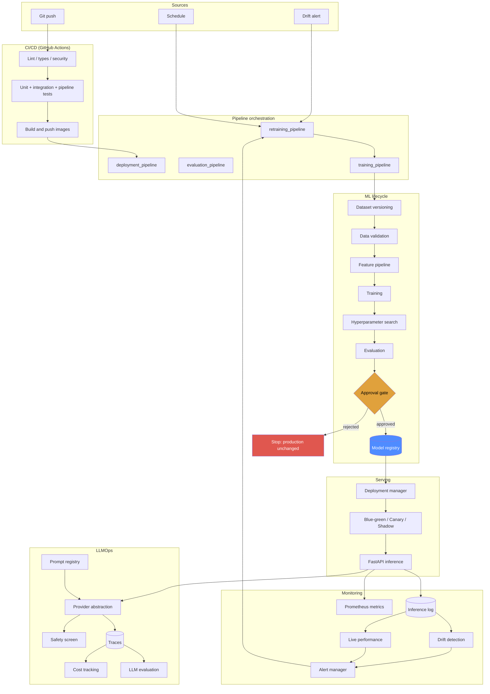
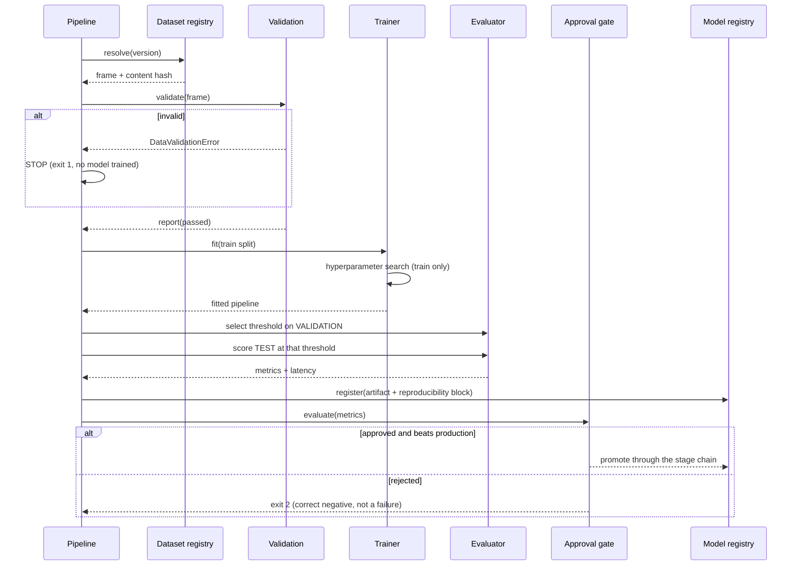

# Architecture

## The problem this solves

Training a model is a bounded task. *Operating* one is not: the data shifts, the
model decays, someone needs to decide whether the new version is actually better,
and when it is not, someone needs to notice before customers do.

FMOps is the machinery around the model. The model itself is deliberately
ordinary — a gradient-boosted classifier over tabular loan applications — because
the interesting engineering is everywhere else.

The same control plane governs LLM-backed features, which have the same lifecycle
problems (versioning, evaluation, rollout, monitoring, cost) with different
mechanics.

## Design principles

**1. Every external system sits behind an interface.**
Local and cloud implementations are peers. The platform never pretends a local
directory is S3 or that an in-process router is SageMaker.

**2. Decisions are recorded, not just made.**
An approval gate emits every check it ran with observed values and thresholds. A
drift scan names every feature it measured. A retraining run records exactly why
the candidate won or lost. Six months later you can answer "why is v7 in
production?" from the database.

**3. Honest degradation.**
When a backend is unavailable, the platform says so loudly and continues in a
clearly-labelled reduced mode — or refuses, if continuing would be misleading.
In production, an unavailable LLM provider raises rather than silently returning
mock text.

**4. The gate is the product.**
Training that succeeds is not a reason to deploy. Nothing reaches production
without clearing an absolute quality bar *and* beating the incumbent by a
configured margin.

## System overview



## Local vs AWS

Every capability has a local implementation that genuinely works and an AWS
adapter that genuinely calls AWS. Neither impersonates the other.

| Capability | Interface | Local | AWS |
|---|---|---|---|
| Artifacts | `ArtifactStore` | filesystem | S3 (`boto3`) |
| Tracking | `ExperimentTracker` | MLflow → SQLite | MLflow server → RDS + S3 |
| Registry | `ModelRegistry` | SQLite | MLflow Model Registry |
| Deployment | `DeploymentProvider` | in-process weighted routing | SageMaker endpoints + variant weights |
| Tuning | `Tuner` | random/grid search | SageMaker HPO jobs |
| Metrics | Prometheus | `/metrics` scrape | + CloudWatch |
| Alerts | `AlertSink` | log, SQLite, file, webhook | SNS |
| LLM | `LLMProvider` | deterministic mock | Bedrock / Anthropic / Gemini / OpenAI-compatible |
| Validation | `ValidationEngine` | native engine | Great Expectations (optional) |
| Drift | `DriftEngine` | native PSI/JS/KS/χ² | Evidently (optional) |

Switching is configuration, not code:

```bash
FMOPS_AWS__ENABLED=true \
FMOPS_AWS__S3_BUCKET=my-bucket \
FMOPS_DEPLOYMENT__PROVIDER=sagemaker \
FMOPS_TRACKING__REGISTRY_BACKEND=mlflow \
fmops deploy --version 7 --strategy canary
```

### Why native validation and drift engines?

Great Expectations and Evidently are excellent, and both are wired in as
adapters. They are not the default because they pin heavy transitive dependency
trees that make a fresh install fragile. The native engines are a few hundred
lines of real statistics, always available, and fully unit-tested — so drift
detection cannot break because of an unrelated dependency resolution. Both paths
produce identical `ValidationReport` / `DriftReport` objects, so the pipeline
does not know or care which ran.

## The training pipeline



Two details that matter:

- **The threshold is chosen on validation data and frozen before touching test
  data.** At an 18% positive rate, 0.5 is a poor operating point; selecting the
  threshold on test data would inflate the reported F1 by roughly 5 points.
- **The whole `Pipeline` is serialised**, feature engineering included. The
  serving path cannot apply different preprocessing than training did, which
  removes the most common source of training/serving skew.

## Deployment strategies

| Strategy | Traffic | Blast radius | Use when |
|---|---|---|---|
| **Direct** | 0 → 100% instantly | full | development |
| **Blue/green** | staged at 0%, health-checked, then 100% | full, briefly | two versions must not run concurrently |
| **Canary** | 10 → 25 → 50 → 100%, evidence-gated | proportional | default for production |
| **Shadow** | 0% (mirrored) | none | you need production evidence with zero risk |

Canary promotion reads the **persisted** inference log rather than in-process
counters, so the decision survives a restart and is identical across workers.
A step that saw fewer than `canary_min_requests_per_step` requests is recorded
as *passed with insufficient evidence* rather than being silently treated as
healthy — with three requests, one error is 33% and means nothing.

Shadow mode can show latency, error rates and prediction divergence under real
traffic. It **cannot** show accuracy, because shadow traffic is unlabelled at
scoring time.

## Rollback

Three versions are always known per endpoint:

```
current_version    what is serving now
previous_version   what was serving before the last successful deployment
candidate_version  what is rolling out (or shadowing)
```

Target selection is explicit and ordered: an explicit `to_version`, else the
recorded `previous_version`, else the registry's most recently archived
ex-production version. If none exists, rollback **raises** rather than guessing.

Rollback also repairs the registry: the failed version is demoted out of
Production and the restored version is walked back up, so the registry never
claims a version is live when it is not.

## State

Operational state lives in SQLite (`artifacts/state/fmops.db`): model versions
and their transition history, deployments and events, the inference log, ground
truth, drift reports, alerts, retraining events, LLM traces and evaluations, and
the audit log.

SQLite because it needs no server and behaves identically on a laptop and in a
container with a mounted volume. Every table is reached through a repository
class in its owning module, so moving to Postgres/RDS means replacing one class
(`app/core/db.py:Database`) rather than hunting SQL across the codebase.

**Known limitation:** SQLite serialises writes. It is fine for a single API
process and the traffic volumes this platform is demonstrated at; a multi-replica
production deployment should move to Postgres. See `docs/deployment.md`.

**On the deployed task this state is ephemeral.** The AWS deployment runs one
Fargate task with no mounted volume, so `artifacts/` lives in the container's
writable layer: every task-definition revision starts from an empty registry
and `/health/ready` returns 503 until a model is promoted again. That is a
consequence of choosing container-local storage, not of SQLite -- the same
database on EFS or RDS would persist. It is stated wherever it could mislead
rather than left for someone to discover after a deploy.

## Deployed runtime

```
Internet ──HTTP:80──▶ ALB ──:8000──▶ ECS/Fargate task (1) ──▶ uvicorn (1 worker)
                                                               │
                                          in-process model ◀───┤
                                          SQLite + MLflow  ◀───┤
                                          mock LLM         ◀───┘
```

Two public subnets across two AZs (an ALB requires two), no NAT gateway, no
private subnets. The model is scored **inside the API process**: the container
runs on AWS, the model does not run on an AWS ML service. `provider=local` is
what `/api/v1/config` reports, and the console shows that rather than inferring
"AWS" from the container's location. The SageMaker provider implements the same
`DeploymentProvider` interface and is the path to managed serving, but it is not
what is deployed. See [`deployment.md`](deployment.md#ecs--fargate--what-is-actually-deployed).

## Request path

```mermaid
sequenceDiagram
    participant C as Client
    participant M as Middleware
    participant S as PredictionService
    participant D as DeploymentProvider
    participant Cache as ModelCache
    participant L as Inference log

    C->>M: POST /api/v1/predict
    M->>M: request id, auth, timer
    M->>S: predict_one(features)
    S->>D: resolve(endpoint)
    D->>D: weighted choice across versions
    D->>Cache: get(model, version)
    Cache-->>S: pipeline + threshold
    S->>S: score, apply the model's own threshold
    S->>L: record (async-safe, never fails the request)
    S->>D: shadow model?
    D-->>S: shadow pipeline
    S->>S: score shadow (isolated; errors swallowed and logged)
    S-->>C: prediction + version + variant + latency
```

The response names the version and variant that served it, so a canary or shadow
rollout is visible per-response rather than only in aggregate.

## Failure handling

| Failure | Behaviour |
|---|---|
| Invalid dataset | Pipeline stops at validation; no model trained; exit 1 |
| Training error | `TrainingError` with the algorithm and params; run marked FAILED in MLflow |
| Every HPO trial fails | `TuningError` listing the first error; run aborts |
| MLflow unreachable | Falls back to the local tracker, logs ERROR naming the impact |
| Registry unreachable | Falls back to SQLite, logs ERROR |
| Model artifact missing | `ModelNotLoadedError`; readiness fails; traffic is never routed to it |
| Candidate fails health check | Traffic never moves (blue/green) or rolls back (canary) |
| Canary error budget breached | Immediate rollback to the incumbent |
| Post-deploy smoke test fails | Automatic rollback |
| Candidate worse than production | Rejected, archived with the reason, production untouched |
| Drift above threshold | Alert raised; retraining trigger fires (subject to cooldown) |
| LLM provider unavailable | Mock fallback in dev with a loud ERROR; **raises** in production |
| Safety violation | Request blocked, trace recorded with `status=blocked` |
| Alert sink down | Logged as ERROR; the alert is still persisted locally; the caller is unaffected |

Nothing swallows an error silently. Where an exception is caught deliberately —
shadow scoring, alert delivery, inference logging — it is because the failure
must not affect the caller, and it is always logged with its impact.

## Repository layout

```
app/
  core/        config, logging, exceptions, database, storage, audit
  data/        generator, validation, preprocessing, versioning
  training/    train, evaluate, tuning, model factory, approval, registry helpers
  registry/    ModelRegistry interface + SQLite and MLflow backends
  tracking/    ExperimentTracker interface + MLflow and local backends
  deployment/  provider interface, local + SageMaker, strategies, rollback, manager
  monitoring/  metrics, inference log, drift, alerts, resources, service
  retraining/  trigger evaluation, retraining pipeline
  llmops/      providers, prompts, evaluation, safety, cost, tracing, client
  aws/         boto3 session, SageMaker, CloudWatch
  api/         FastAPI app, routes, serving, security, errors, dashboard
  schemas/     pydantic contracts shared across layers
pipelines/     CI/SageMaker entrypoints with meaningful exit codes
tests/         unit / integration / pipeline
terraform/     S3, ECR, IAM, CloudWatch, SNS, SageMaker registry
monitoring/    Prometheus config, alert rules, Grafana dashboards
```

## Further reading

- [`mlops.md`](mlops.md) — training, registry, gates, retraining
- [`llmops.md`](llmops.md) — prompts, evaluation, safety limitations, cost
- [`monitoring.md`](monitoring.md) — metrics, drift taxonomy, SLOs
- [`deployment.md`](deployment.md) — local, Docker, AWS, security posture
- [`troubleshooting.md`](troubleshooting.md) — what to do when it breaks
