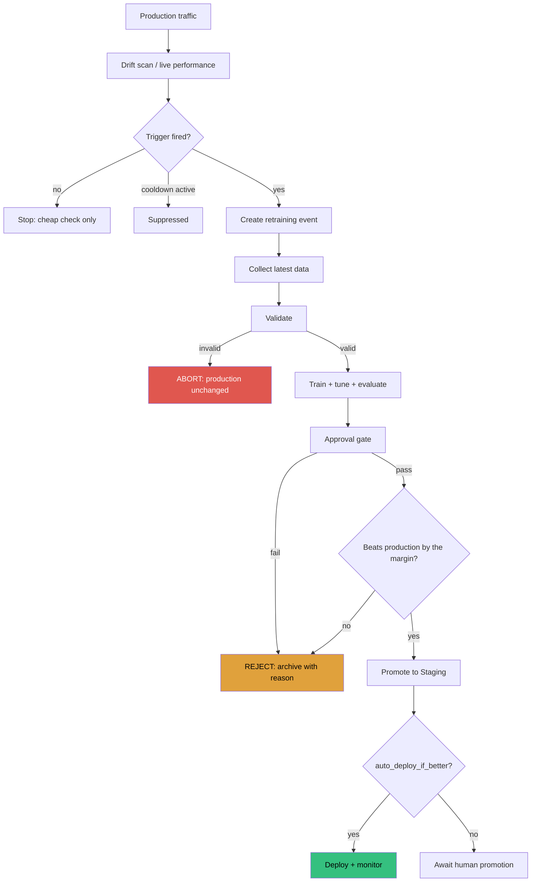

# MLOps

How a model gets from a dataset to production, and what stops it.

## The reference problem

Binary classification of consumer loan applications: will this borrower default?

- **14 raw features** — 10 numeric (age, income, credit score, DTI, utilisation,
  late payments, …), 4 categorical (employment type, housing, purpose, region).
- **8 derived features** computed inside the pipeline (loan-to-income, monthly
  payment, payment-to-income, credit-score band, flags, ratios).
- **37 model inputs** after one-hot encoding.
- **~18% positive rate** — realistic imbalance for an unsecured loan book.
- **Held-out ROC-AUC ≈ 0.88, F1 ≈ 0.63** at the selected threshold.

The data is generated deterministically by `app/data/generator.py`, with
correlated features (credit score depends on late payments and utilisation;
income depends on age and tenure; loan size depends on income) and a target
driven by a logistic function of those features. No network access, fully
reproducible from a seed.

**Why synthetic?** Because the platform needs to demonstrate *drift* and
*retraining*, and that requires the ability to shift a distribution on demand
and know exactly what shifted. A downloaded static dataset cannot do that.

## Dataset versioning

Two mechanisms, both always recorded:

**Content addressing (always on).** Every registered dataset gets a version id
derived from its SHA-256: `v3-a1b2c3d4`. The manifest records the hash, row and
column counts, schema, git commit and parent version. Registering identical
bytes twice returns the existing version — versions are content, not events.

**DVC (optional).** When DVC is installed and initialised, the same file is also
`dvc add`-ed. `DVCTracker` reports honestly whether it actually tracked
something, so `dvc_tracked: false` in the manifest means exactly that rather
than an unverified claim.

```bash
make dvc-init        # optional
fmops data generate
fmops data versions
```

Loading a version verifies its hash first: if the file on disk changed since
registration, the load **fails** rather than silently training on different data.

## Data validation

The first gate. `PASSED` → continue; `FAILED` → the pipeline stops and no model
is trained.

Checks: row count, required columns, unexpected columns, dtypes, null fraction
per column, duplicate rows, duplicate identifiers, value ranges, categorical
value sets, robust-z outlier share, target binarity, class balance.

Two design decisions worth knowing:

- **Outliers are warnings, not errors.** Real production data has outliers; a
  blocking outlier check would stop the pipeline constantly. Set
  `fail_on_warning: true` (as `production.yaml` does) to promote them.
- **Low-cardinality numeric columns skip the outlier check.** A robust z-score
  over `loan_term_months` (7 distinct values) flags the rare terms as outliers,
  which is noise. Range and value-set checks already cover those columns.

```bash
fmops data validate            # exit 0 = passed, 1 = failed
fmops data validate --json     # the full report
```

`app/data/validation.py` implements the native engine; a Great Expectations
adapter produces the identical `ValidationReport` when the `[quality]` extra is
installed.

## Training

```bash
fmops train --tune
make train
python -m pipelines.training_pipeline --promote --report run.json
```

Stages: load → validate → split → preprocess → tune → fit → evaluate → persist →
register. Each is timed and logged with a correlation id.

**Threshold selection.** The default 0.5 cut-off is wrong for an 18% positive
rate. The pipeline picks the F1-maximising threshold **on the validation split**,
then applies it unchanged to test data. Choosing it on test data would inflate
reported F1 by roughly 5 points. The chosen threshold ships with the model in its
sidecar metadata, so serving cannot silently use a different operating point.

**What makes a run reproducible.** Every run records: dataset version, dataset
content hash, git commit, the *effective* hyperparameters (defaults resolved, not
just overrides), the chosen threshold, the feature column list, and Python /
numpy / pandas / scikit-learn versions.

Recording only the overrides would be a trap: the run could not be reproduced
without also knowing which library version's defaults were in force.

## Hyperparameter optimisation

One `Tuner` interface, three backends:

| Backend | Behaviour |
|---|---|
| `local_random` | random search over the declared space, capped at `max_trials` (default) |
| `local_grid` | exhaustive grid |
| `sagemaker` | a SageMaker Bayesian HPO job |

The declared space uses generic keys (`n_estimators`, `max_depth`,
`learning_rate`) which `PARAM_ALIASES` maps onto each estimator's real parameter
names — so one configured space works across algorithms, and meaningless
combinations (a learning rate for a random forest) are dropped rather than
raising.

Search runs stratified cross-validation **on the training split only**. The test
split is never touched during search, which is what keeps the reported test
metrics trustworthy.

A trial that fails is recorded as a failed trial and the search continues; if
*every* trial fails, `TuningError` is raised with the first error rather than
returning a meaningless "best".

## Evaluation

Tracked per version: accuracy, precision, recall, F1, ROC-AUC, PR-AUC, log loss,
Brier score, confusion matrix, per-class metrics, calibration curve, feature
importance, and p50/p95 inference latency.

**Latency is measured, not guessed.** `measure_inference_latency` times
single-row predictions through the full fitted pipeline — the honest measure for
a real-time endpoint. Batch throughput would flatter the numbers.

**Feature importance** falls back to permutation importance over the *raw* input
columns when the estimator exposes neither `feature_importances_` nor `coef_`
(as `HistGradientBoostingClassifier` does not). Raw-column attribution is what an
operator actually wants to reason about, and the fallback is labelled as such.

## Model registry

Every version carries the artifact URI plus the full reproducibility block, and
moves through an enforced stage machine:

```
Development ──▶ Validation ──▶ Staging ──▶ Production
     │              │             │            │
     └──────────────┴─────────────┴────────────┴──▶ Archived
                                               ◀── (Production → Staging = rollback)
```

Rules enforced by `assert_transition`:

- Forward moves follow the chain. `Development → Production` is rejected with
  the list of legal targets.
- Any stage may be archived; archived may only be reinstated to Development.
- `Production → Staging` is legal — that is what a rollback does.
- **Exactly one Production version per model.** Promoting a new one archives the
  incumbent, and that archival is what `previous_production()` later reads to
  find the rollback target.

Two backends behind one interface: SQLite (default) and MLflow Model Registry.
The MLflow adapter maps stages onto tags plus aliases, because MLflow 3.x removed
the built-in `stage` field — so `models:/name@production` still resolves for
anyone loading through MLflow directly.

```bash
fmops models
curl localhost:8000/api/v1/models/loan_default_classifier/versions
curl localhost:8000/api/v1/models/loan_default_classifier/history
```

## The approval gate

**Training successfully is not a reason to deploy.** Two independent gates:

### Absolute quality

```yaml
approval:
  min_f1: 0.60
  min_roc_auc: 0.70
  min_precision: 0.0
  min_recall: 0.0
  max_inference_latency_ms: 250.0
  require_clean_validation: true
  max_drift_score: 0.30
```

Every check is recorded with its observed value and threshold:

```
Approval gate -- loan_default_classifier v3
  decision: REJECTED
  [PASS] roc_auc: observed=0.8824 threshold=0.7
  [FAIL] f1: observed=0.5100 threshold=0.6  0.5100 fails >= 0.6000
  [PASS] inference_latency_p95_ms: observed=15.2 threshold=250.0
  [PASS] data_validation: observed=passed threshold=passed
  reason: failed gate checks: f1
```

### Champion vs challenger

```yaml
approval:
  comparison_metric: roc_auc
  min_improvement: 0.005
```

A candidate must beat the incumbent by at least `min_improvement`. With no
incumbent, the candidate wins by default — there is nothing to protect.

**Why a margin and not just "greater than"?** Run-to-run variance on a fixed
dataset is easily ±0.003 ROC-AUC. Promoting on any positive delta means churning
the production model on noise, invalidating every A/B measurement in flight, and
paying deployment risk for nothing.

Real output from the demo:

```
Comparison (roc_auc): candidate 0.8821 vs baseline 0.8824 (-0.0003) -> reject
Promotion: NO -> stage Development
  reason: candidate roc_auc 0.8821 does not beat production 0.8824 by the
          required margin 0.0050 (actual -0.0003); keeping the production model
```

Production stayed on v1. That is the platform working.

`require_manual_approval: true` (the production default) holds an
otherwise-passing model at `PENDING_MANUAL` until a human acts.

## Retraining



### Triggers

| Trigger | Fires when | Needs labels? |
|---|---|---|
| `drift` | the latest scan exceeded its threshold | no |
| `performance` | live ROC-AUC fell below the offline baseline by more than the tolerance | **yes** |
| `volume` | enough new production rows accumulated | no |
| `schedule` | cron (evaluated by CI) | no |
| `manual` | someone asked | no |

**Cooldown.** After a retraining event, automatic triggers are suppressed for
`cooldown_minutes`. Without it, a persistent drift condition launches a
retraining run on every scan.

**Trigger evaluation never trains.** It returns a decision object, which makes
the logic trivially testable and lets the API answer "would this fire, and why?"
with no side effects:

```bash
fmops retrain --check-only
curl localhost:8000/api/v1/retraining/trigger/evaluate
```

### Outcomes

The retraining pipeline's exit code distinguishes three things CI must treat
differently:

| Exit | Meaning | CI response |
|---|---|---|
| 0 | nothing to do, or the candidate was promoted | success |
| 2 | a candidate was trained and **correctly rejected** | success with a note — do not page |
| 1 | the run itself failed | open an incident |

Conflating 1 and 2 is a common mistake: it trains operators to ignore retraining
alerts, because most of them are the system working correctly.

## The commands

```bash
fmops data generate            # deterministic sample datasets, registered
fmops data validate            # the validation gate
fmops data versions            # dataset lineage + DVC status
fmops train --tune             # full training pipeline
fmops promote --version 3      # approval gate + promotion
fmops models                   # the registry
fmops deploy --strategy canary
fmops simulate --rows 500 --label-fraction 0.3
fmops drift scan
fmops retrain --check-only
fmops retrain
fmops rollback
fmops status
```

## Known limitations

- **Single-node training.** No distributed training; the reference model does not
  need it. SageMaker training jobs are the escape hatch for larger work.
- **No feature store.** Features are computed inside the pipeline. That
  eliminates training/serving skew for this design, but does not solve feature
  sharing across teams or point-in-time correctness for time-travel joins.
- **SQLite serialises writes.** Fine for one API process; a multi-replica
  deployment should move to Postgres (one class to replace).
- **Live performance needs labels.** Without ground truth submitted to
  `/api/v1/feedback`, production accuracy is reported as unavailable rather than
  estimated. That is a deliberate choice, but it does mean the `performance`
  trigger is inert until a labelling loop exists.
